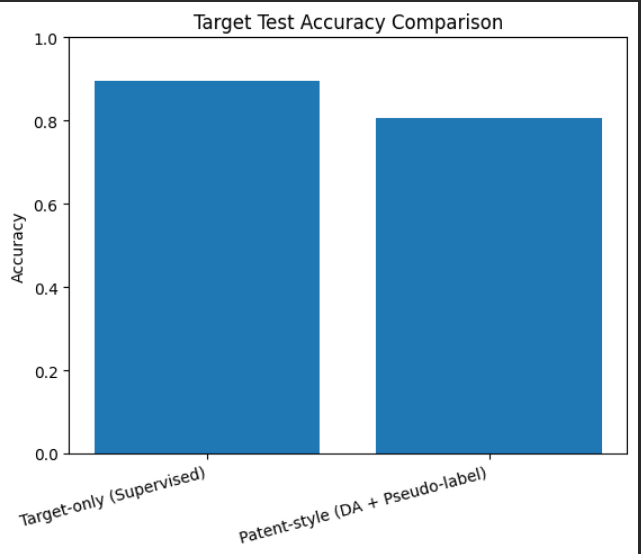
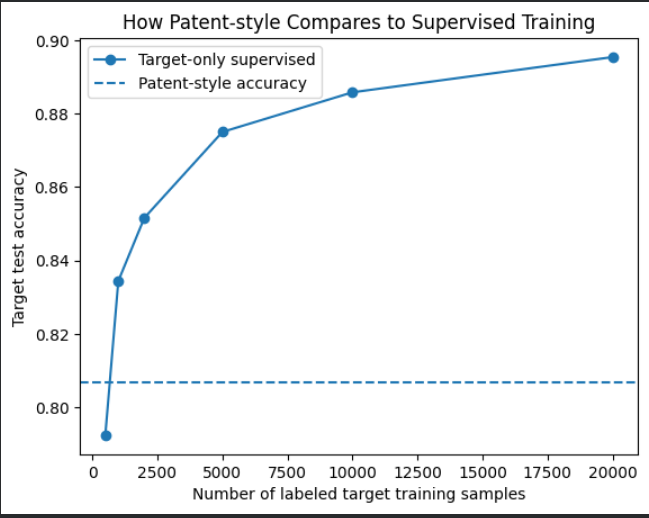
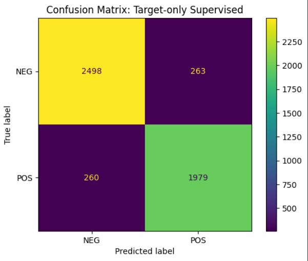
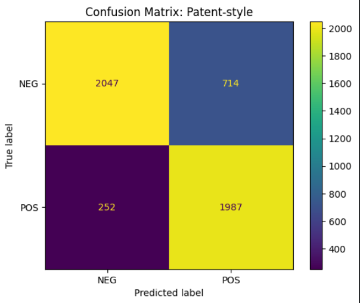

# Cross-Domain Target Classifier Training  
### Implementation of US Patent 20180068231 with Embedding-Based Extension

---

## Results Summary

### Quantitative Comparison (Yelp Test Set)

| Model                                   | Target Test Accuracy |
|------------------------------------------|----------------------|
| Traditional (Target-Only Supervised)    | **0.8954**           |
| Patent-Style (Source + Target Unlabeled)| **0.8068**           |

**Accuracy Gap:** -0.0886  

The domain-adaptation framework achieves **80.68% accuracy without using labeled target data during training**, compared to 89.54% when fully supervised.

## Visual Comparison

<table>
<tr>
<td align="center">
<b>Accuracy Comparison</b> 

</td>

<td align="center">
<b>Supervised Training Curve</b> 

</td>
</tr>

<tr>
<td align="center">
<b>Confusion Matrix – Supervised</b> 

</td>

<td align="center">
<b>Confusion Matrix – Patent-Style</b> 

</td>
</tr>
</table>

## Problem Setting

We consider a cross-domain sentiment classification scenario:

- **Source domain (labeled):** Amazon Polarity Dataset  
- **Target domain (unlabeled for training):** Yelp Polarity Dataset  

The objective is to train a target-domain classifier without directly using labeled target data during training.

---

## Method Overview

This implementation follows the core framework proposed in:

**“Method and System for Training a Target Domain Classifier to Label Text Segments”**  
US Patent No. 20180068231  
Inventors: Raksha Sharma, Sandipan Dandapat, Himanshu Sharad Bhatt  
Filed by Xerox Research Center of India  

### Core Steps

1. Identify statistically significant source-domain keywords.
2. Label target-domain keywords using an external signal.
3. Extract common keywords with consistent polarity across domains.
4. Train an initial classifier using only shared consistent features.
5. Pseudo-label high-confidence target samples.
6. Train a target-domain classifier iteratively.
7. Combine models through weighted ensembling for refinement.

---

## Extension in This Implementation

Instead of using a predefined sentiment lexicon, this implementation uses:

- Sentence-transformer embeddings  
- Cosine similarity against positive and negative seed vectors  

This provides a semantic external signal for target keyword labeling.

---

## Datasets Used

- Amazon Polarity Dataset (source domain)  
- Yelp Polarity Dataset (target domain)  

Both datasets were obtained from Hugging Face.

---

## Interpretation

While the fully supervised model achieves higher accuracy, the patent-style framework demonstrates that meaningful performance can be achieved without direct access to labeled target training data.

This highlights the practical relevance of domain adaptation when labeled data is scarce.

---

## Attribution

This repository is an independent implementation of the ideas presented in:

Sharma, R., Dandapat, S., Bhatt, H. S.  
*Method and System for Training a Target Domain Classifier to Label Text Segments*  
US Patent 20180068231  

All credit for the original conceptual framework belongs to the inventors.
